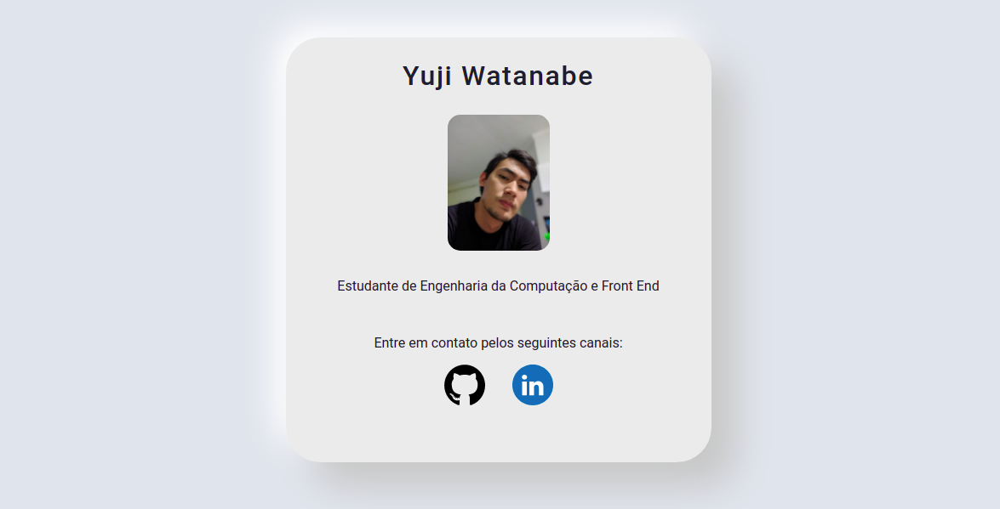

  

## Design com Neuromorphism Card
Mini projeto realizado para desenvolver minhas habilidades em estilização de design com cards e neuromorphism

## 🚀 Tecnologias

Esse projeto foi desenvolvido com as seguintes tecnologias:

- HTML
- CSS

## 📚 O que aprendi:
- Reforcei meu conteúdo de CSS
